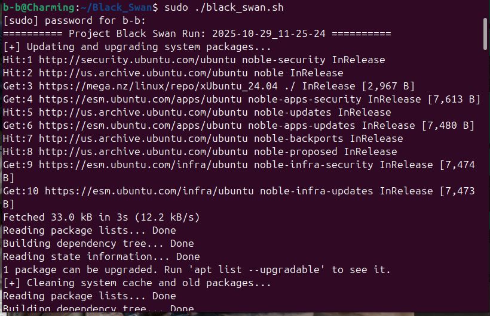
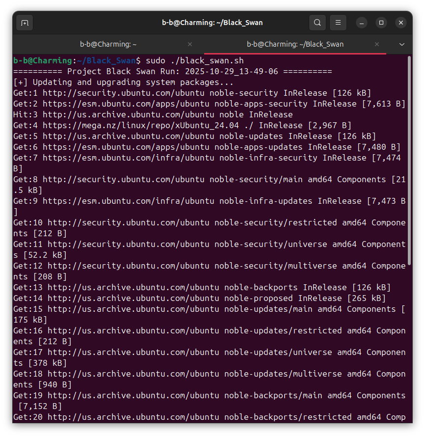
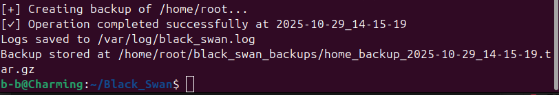

# 🦢 Project Black Swan — Linux Automation Toolkit

**Author:** Benjamin Chaambwa (BBCharming)  
**Version:** 1.0  
**License:** MIT  
**System:** Ubuntu 22.04+  

---

## 🧭 Overview
Project Black Swan is a lightweight **Linux automation toolkit** designed for system administrators, developers, and cybersecurity learners.  
It automates key maintenance tasks while maintaining a secure, timestamped log of all actions.  

This project is part of **Operation Spectre**, an ongoing cybersecurity automation initiative by Benjamin Charming.

---

## ⚙️ Features
- ✅ System update and upgrade automation  
- 🧹 Cleanup of obsolete packages and cache  
- 💾 Timestamped backup of the user's home directory  
- 📜 Secure log file stored in `/var/log/black_swan.log`  

---

## 🚀 Usage Instructions

1. **Clone the repository:**
   ```bash
   git clone https://github.com/BBCharming/Black_Swan.git
   cd Black_Swan
   
2. **Make the script executable:**
    ```bash
   chmod +x black_swan.sh

4. **Run as root:**
   ```bash
    sudo ./black_swan.sh


6. **Check outputs:**
    ```bash
   Logs: /var/log/black_swan.log

   Backup: /home/username/black_swan_backups/home_backup_YYYY-MM-DD_HH-MM-SS.tar.gz

🧰 Expected Output 
Screenshot terminal output:





========== Project Black Swan Run: 2025-10-29_10-05-00 ==========
[+] Updating and upgrading system packages...
[+] Cleaning system cache and old packages...
[+] Creating backup of /home/username...
[✓] Operation completed successfully at 2025-10-29_10-05-00
Logs saved to /var/log/black_swan.log
Backup stored at /home/username/black_swan_backups/home_backup_2025-10-29_10-05-00.tar.gz

---

🧠 Author’s Notes
Designed for learning and practical Linux automation experience

First deployment under Operation Spectre

Extensible for additional automation scripts

📜 License
This project is licensed under the MIT License, free for personal, educational, or professional use.
